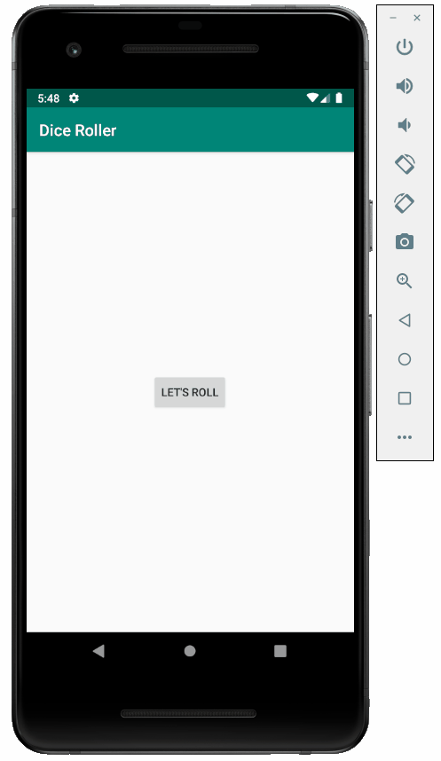

# Dice Roller

An Android application that simulates a dice roll.

Submitted by: Yusley Rosabal Espinosa

Time spent: 2 hours

## User Stories

The following **required** functionality is complete:

* [X] Implemented LinearLayout view group.
* [X] Added interactive button.
* [X] Optimize app by using lateinit to search view hierarchy only once.
* [X] User can press button to simulate a die roll.

The following **additional** features are implemented:

* [X] Added images to simulate a dice and make the app more interactive with the user.
* [X] Use random integer number from 1 to 6.

## Video Walkthrough 

Here's a walkthrough of implemented user stories:

## Notes

This is my first time that I made an app and the first time that I worked with android studio, so 
everything is new for me and difficult to understand. However, the videos show everything clearly
making the learning easier.

## License

Copyright 2018 Yusley Rosabal Espinosa

Licensed under the Apache License, Version 2.0 (the "License");
you may not use this file except in compliance with the License.
You may obtain a copy of the License at

http://www.apache.org/licenses/LICENSE-2.0

Unless required by applicable law or agreed to in writing, software
distributed under the License is distributed on an "AS IS" BASIS,
WITHOUT WARRANTIES OR CONDITIONS OF ANY KIND, either express or implied.
See the License for the specific language governing permissions and
limitations under the License.
